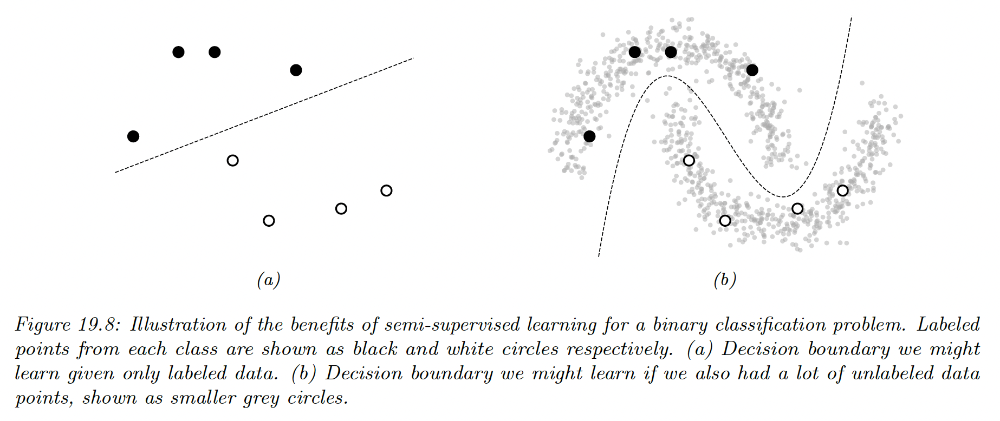
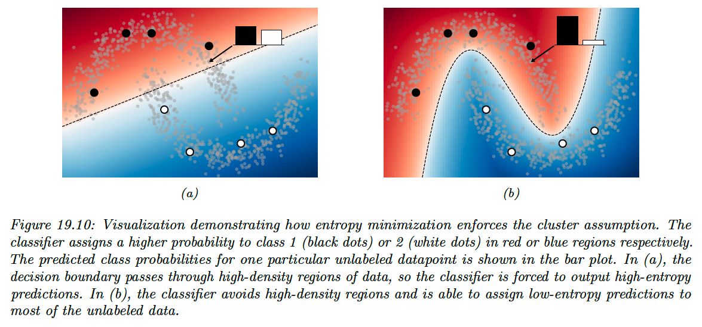
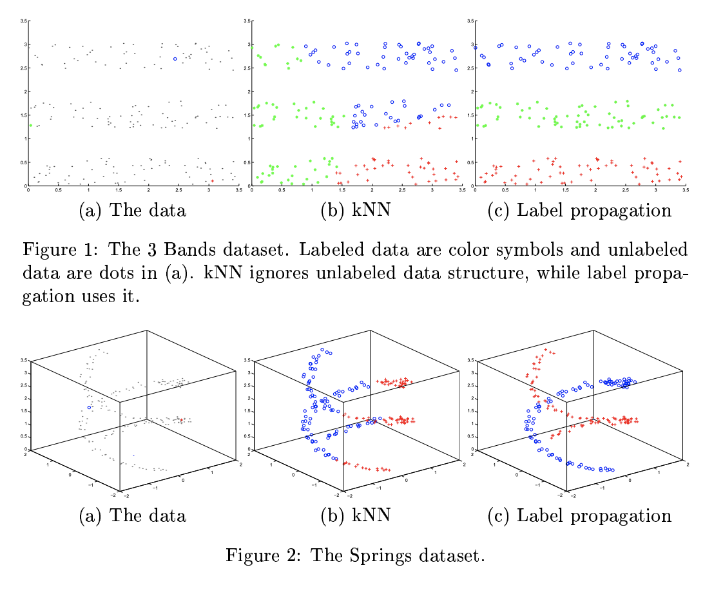
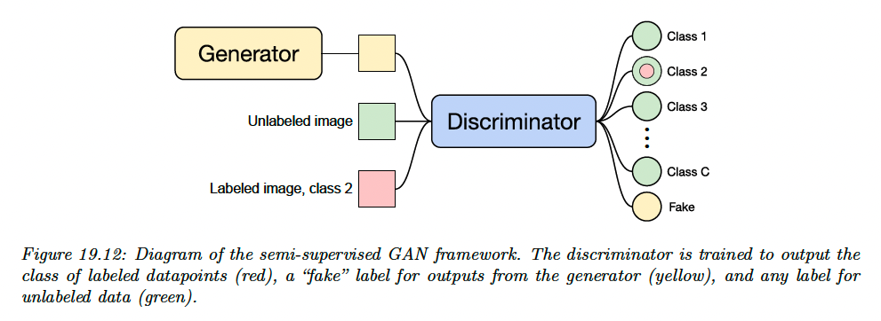
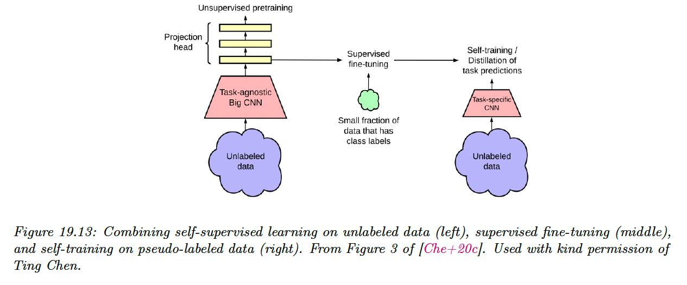

# 19.3 Semi-supervised learning

Large labeled dataset for supervised learning is often expensive. In automatic speech recognition, modern datasets contain thousand of hours of recording, and annotating the words spoken is slower than realtime.

To make matters worst, in some applications, data must be labeled by an expert (such as in medical applications) which can further increase cost.

**Semi-supervised learning** can alleviate the need of labeled data by leveraging unlabeled data. Its general goal is to learn the high level structure of the unlabeled data distribution, and only rely  on labeled data to learn the fine-grained details of a given task.

In addition to samples from the joint distribution of data $\bold{x},y\sim p(\bold{x},y)$, semi-supervised learning also assumes to have access to the marginal distribution of $\bold{x}$, namely $\bold{x}\sim p(\bold{x})$.

Further, we also assume to have many more unlabeled data than labeled data, since, in the example of ASR, recording people talking is cheap.

Semi supervised learning is therefore a good fit in the scenario where a large amount of unlabeled data has been collected and we prefer to avoid labeling all of it.

### 19.3.1 Self-training and pseudo-labeling

The basic idea of self-training is to infer predictions on unlabeled data, and then use these predictions as labels for subsequent training.

Self-training has endured as an approach to semi-supervised learning because of its simplicity and general applicability, and it has recently been called **pseudo-labeling**, by opposition to the ground truth labels used in supervised learning.

Algorithmically, self-training follows of the following two procedures.

In the first offline approach:

1. Pseudo labels are predicted for the entire unlabeled dataset
2. The model is retrained (possibly from scratch) on the combination of the labeled and pseudo-labeled datasets.
3. Repeat to 1.

In the second online approach:

1. Pseudo labels are continuously predicted on randomly chosen batches of the unlabeled data
2. The model is immediately retrained on this batch of pseudo labels
3. Repeat to 1.

Both approaches are popular in practice; the offline one has been shown to be particularly successful when leveraging giant collections of unlabeled data, whereas the online is often used as a step of more complex semi-supervised learning methods.

The offline approach can result in training models on stale pseudo-labels since they are only updated each time the model converged, but the online approach can be more computationally expensive since it involves constantly “relabeling” unlabeled data.

However, self-training can suffer from **confirmation bias**: if the model generates incorrect predictions for the unlabeled data and then is re-trained on them, it can become progressively worse at the intended classification task. ****

We can mitigate confirmation bias by using a “selection metric” to only retain correct pseudo-labels. For example, assuming that model outputs probability for each class, we can retain pseudo-labels whose largest class probability is above some threshold.

If the model’s class probability estimate are well calibrated, then this selection metric rule will only retain labels are highly likely to be correct.

### 19.3.2 Entropy minimization

Self-training has the implicit effect of encouraging the model to output low-entropy (i.e. high confidence) predictions. This effect is most apparent in the online setting with a cross-entropy loss, where the model minimizes the following loss function on the unlabeled data:

$$
\mathcal{L}=-\max_{c}\log p_\theta(y=c|\bold{x})
$$

This function is minimized when the model assigns all its probability to a single class $c^*$, i.e. $p(y=c^*|\bold{x})=1$ and $p(y\neq c^*|\bold{x})=0$
.

A closely-related semi-supervised learning method is **entropy minimization**, ****which minimizes the loss:

$$
\mathcal{L}=-\sum_{c=1}^C p_\theta(y=c|\bold{x})\log p_\theta(y=c|\bold{x})
$$

Note that this function is also minimized when the model assigns all of its class probability to a single class.

We can make the entropy-minimization loss equivalent to the online self-training loss by replacing the first $p_\theta(y=c|\bold{x})$ term with a “one-hot” vector that assign a probability of 1 for the class with the highest probability.

In other words, online self-training minimizes the cross-entropy loss between the model’s output and the **“hard”** target $\argmax_cp(y=c|\bold{x})$, whereas entropy minimization uses the **“soft”** target $p_\theta(y|\bold{x})$.

One way to trade-off between these two extremes is to adjust the “temperature” of the target distribution by raising each probability to $p(y=c|\bold{x})^{1/T}$ and renormalizing. This is the basis of the **mixmatch** method.

At $T=1$, this is equivalent to entropy minimization, as $T\rightarrow 0$, it becomes hard online self-training.

**19.3.2.1 The cluster assumption**

Why is entropy minimization a good idea? A basic assumption of many semi-supervised learning method is that the decision boundary between class should fall in a low-density region of the data manifold.

This assumes that the data corresponding to different classes are clustered together. A good decision boundary, therefore, should not pass through clusters, it should separate them.

Semi-supervised learning method that make the **“cluster assumption”** can be thought of using unlabeled data to estimate the shape of the data manifold and moving the decision boundary away from it.

Entropy minimization is one such method, since for smooth decision boundaries, entropy will be minimized when the decision boundary is place in low-density regions of the input space.

**19.3.2.2 Input-output mutual information**

An alternative justification for the entropy minimization objective was proposed by Bridle, Heading and MacKay, where they shown that it naturally arises from maximizing the mutual information between the data and the label:

$$
\begin{align}
\mathcal{I}(y;\bold{x})&=\int\int  p(y,\bold{x})\log \frac{p(y,\bold{x})}{p(y)p(\bold{x})}dyd\bold{x} \\
&= \int \int p(\bold{x})p(y|\bold{x})\log \frac{p(y,\bold{x})}{p(y)p(\bold{x})}dyd\bold{x} \\
&= \int p(\bold{x})d\bold{x} \int p(y|\bold{x})\log \frac{p(y|\bold{x})}{p(y)}dy \\
&=\int p(\bold{x})d\bold{x} \int p(y|\bold{x})\log \frac{p(y|\bold{x})}{\int p(\bold{x}) p(y|\bold{x})d\bold{x}}dy
\end{align} 
$$

Note that the first integral is equivalent to taking an expectation over $\bold{x}$, and the second integral is equivalent to summing over all possible values of the class $y$. We get:

$$
\begin{align}
\mathcal{I}(y;\bold{x}) &=\mathbb{E}_\bold{x}\Big[\sum_{i=1}^Lp(y_i|\bold{x})\log \frac{p(y_i|\bold{x})}{\mathbb{E}_\bold{x}[p(y_i|\bold{x})]}\Big] \\
&= \mathbb{E}_\bold{x}\Big[\sum_{i=1}^L p(y_i|\bold{x})\log p(y_i|\bold{x})\Big]-\mathbb{E}_\bold{x} \Big[\sum_{i=1}^L p(y_i|\bold{x})\log \mathbb{E}_\bold{x}[p(y_i|\bold{x})] \Big] \\
&= \mathbb{E}_\bold{x}\Big[\sum_{i=1}^L p(y_i|\bold{x})\log p(y_i|\bold{x})\Big]-\sum_{i=1}^L\mathbb{E}_\bold{x}[p(y_i|\bold{x})\log \mathbb{E}_\bold{x}[p(y_i|\bold{x})]]
\end{align}
$$

Since we have initially sought to maximize the mutual information, we can convert it to a loss function to minimize by negating it:

$$
\mathcal{L}=-\mathcal{I}(y;\bold{x})
$$

The first term is exactly the entropy minimization objective in expectation.

The second term specifies that we should maximize the entropy of the average class prediction over our training set. This encourages the model to predict each possible class with equal probability, which is only appropriate when we don’t have imbalanced class.

### 19.3.3 Co-training

**Co-training** is also similar to self-training, but makes an additional assumption that there are two complementary views (i.e. independent sets of features) of the data.

After training two models separately on each view, unlabeled data is classified by each model to obtain candidate pseudo-labels. If a particular pseudo-label receives a low-entropy prediction (high confidence) from one model and high-entropy from the other, then that example is added to the training set for the high-entropy model.

Then, the process is repeated with the new, larger training datasets.

Retaining pseudo-labels when one of the models is confident ideally builds up the training sets with correctly-labeled data.

Co-training makes the strong assumption that there are two informative-but-independent views of the data, which may not be true for many problems.

The **Tri-Training** algorithm circumvents this issue by instead using three models that are first trained on independently-sampled (with replacement) subsets of the labeled data. Ideally, this leads to models that don’t always agree on their predictions.

Then, pseudo-labels are predicted by the three models. If two models agree on the pseudo-label of a given example, it is added to the training set for the third model.

This can be seen as a selection metric, because it only retains pseudo-labels where two (differently initialized) models agree on the correct label.

The models are the re-trained on the combination of the labeled data and the new pseudo-labels, and the whole process is repeated iteratively.

### 19.3.4 Label propagation on graphs

If two points are similar, we can expect them to share the same label. This is known as the **manifold assumption**.

**Label propagation** is a semi-supervised technique that leverages the manifold assumption to assign labels to unlabeled data.

It first constructs a graph where the examples are the nodes and the edges are the similarity between points. The node labels are known for labeled example but are unknown for unlabeled example.

Label propagation then propagates the known labels across edges of the graph in such a way that there is minimal disagreement in the labels of a given node’s neighbors.

This provides label guesses for the unlabeled data, which can then be used in the usual way for the supervised training of a model.

More specifically, the [basic label propagation algorithm](https://mlg.eng.cam.ac.uk/zoubin/papers/CMU-CALD-02-107.pdf) proceed as follows.

Let $w_{i,j}$ denote a non-negative edge weight between $\bold{x}_i$  and $\bold{x}_j$ that provides a measure of similarity for the two (labeled or unlabeled) examples.

Assuming we have $M$ labeled and $N$ unlabeled examples, define the transaction matrix  $T\in \R^{(M+N)\times (M+N)}$ as having entries:

$$
T_{i,j}=\frac{w_{i,j}}{\sum_k w_{k,j}}
$$

$T_{i,j}$ represent the probability of propagating a label from node $j$ to node $i$.

Further, define the label matrix $Y\in \R^{(M+N)\times C}$, where $C$ is the number of possible classes. The $i$th row of $Y$ represents the class probability distribution for example $i$ (the initialization of $Y$ for unlabeled examples is not important).

Then, repeat until convergence of $Y$:

1. Propagate: $Y\leftarrow TY$
2. Row-normalize: $Y_{ic}=Y_{ic}/\sum_{c'}Y_{ic'}$ 
3. Clamp the label data: replace the rows corresponding of labeled data by their one-hot representation.

The algorithm iteratively uses the similarity of datapoints to propagate labels onto the unlabeled data, in a weighted average way.

It can be shown this procedure converges to a single fixed point, whose computation cost mainly involve inverting the matrix of unlabeled-to-unlabeled transition probabilities.

The overall approach can be seen as a form of **transductive learning** since it is learning to predict the labels of a fixed unlabeled dataset, rather than learning a model that generalizes.

However, by training a model on the induced labeling, we can perform **inductive** **learning** in the usual way.

The success of label propagation depends heavily on the notion of similarity used to construct the weights between datapoints. 

For simple data, measuring the Euclidean distance may be sufficient, but not for more complex and high dimensional data, where it could fail to capture the likelihood that two examples belong to the same class.

These weights can also be set arbitrarily according to problem-specific knowledge.

### 19.3.5 Consistency regularization

Consistency regularization leverages the idea that perturbing a given dataset (or the model itself) shouldn’t cause the model’s output to change dramatically.

Since measuring consistency this way only uses the model’s output, it is readily applicable to  unlabeled data, and therefore can be used to create appropriate loss functions for semi-supervised learning. This idea was first proposed with the paper “learning with pseudo-ensembles”.

In its most general form, both the model $p_\theta(y|\bold{x})$ and the transformations applied to the input can be stochastic. For example, in computer vision problems we may transform the input by using data augmentation like randomly rotating or adding noise to the image, and the network may include stochastic components like dropout or weight noise.

A common and simple form of consistency regularization first samples $\bold{x}'\sim q(\bold{x}'|\bold{x})$, where $q$ is the distribution induced by the stochastic input transformations.

We minimize the combined loss function over of batch of $M$ labeled data and $N$ unlabeled data:

$$
\mathcal{L}(\theta)=-\sum_{i=1}^M \log p_\theta(y=y_i|\bold{x}_i)+\lambda \sum_{j=1}^N ||p_\theta(y|\bold{x}_j)-p_\theta(y|\bold{x}_j')||^2
$$

In practice, the first term of the regularizer $p_\theta(y|\bold{x}_j)$ is treated as fixed, i.e. gradients are not propagated through it.

Many design choices impact the success of this semi-supervised learning approach.

*i)* First, if the parameter $\lambda$ is too large, then the model way not give enough weight to learning the supervised task and will instead start to reinforce its own bad predictions (as with confirmation bias in self-training).

Since the model is often poor at the start of training, it is common practice to initialize $\lambda$ to zero and increase its value over the course of training.

*ii)* A second important consideration is the choice of the random transformations $q$. These transformations should be designed so that they don’t change the label of $\bold{x}$, and are domain specific.

The use of data augmentation requires expert knowledge to determine what kinds of transformations are label preserving and appropriate for a given problem.

An alternative technique is **virtual adversarial training (VAT)**, that transforms the input using analytically-found perturbation $\delta$   designed to maximally change the model’s output.

VAT computes:

$$
\delta=\argmax_\delta D_{\mathbb{KL}}(p_\theta(y|\bold{x})|| p_\theta(y|\bold{x}+\delta))
$$

The approximation is done by sampling $\bold{d}$ from a multivariate Gaussian distribution, initializing $\delta=\bold{d}$ and then setting:

$$
\delta \leftarrow \nabla_{\delta}D_{\mathbb{KL}}(p_\theta(y|\bold{x})||p_\theta(y|\bold{x}+\delta))|_{\delta=\xi \bold{d}}
$$

where $\xi=10^{-6}$ is a small constant.

VAT then sets:

$$
\bold{x}'=\bold{x}+\epsilon\frac{\delta}{||\delta||_2}
$$

Then proceed to consistency regularization, where $\epsilon$ is a scalar hyperparameter that sets the L2 norm of the perturbation applied to the input.

*iii)* Consistency regularization can also profoundly affect the geometry properties of the training objective, and the trajectory of the SGD.

For example, the Euclidean distances between weights at different training epochs are significantly larger for objectives that use consistency regularization.

It has been shown that a variance of stochastic weight averaging (SWA) can achieve state-of-the-art performance on semi-supervised learning tasks by exploiting the geometric properties of consistency regularization.

*iv)* Finally, we only have to consider the choice of the regularizer function measuring the difference between the network’s output with and without perturbation.

The loss above use the squared L2 distance (aka the Brier score), and it is also common to use the LK divergence, in analogy with the cross-entropy loss (i.e. KL divergence between the ground-truth label and prediction) used for labeled examples.

The gradient of the squared-error loss approaches zero as the model’s prediction with and without perturbation differ more and more, assuming the model uses a softmax nonlinearity on its logit output.

Using the squared-error loss therefore has a possible advantage that the model is not updated when its predictions are very unstable.

However, the KL divergence has the same scale as the cross-entropy loss used for labeled data, which makes for more intuitive tuning of $\lambda$.

### 19.3.6 Deep generative models

Generative models provide a natural way of making use of the unlabeled data through learning a model of the marginal distribution by minimizing:

$$
\mathcal{L}_U=-\sum_{n}\log p_\theta(\bold{x}_n)
$$

Various approaches have leveraged generative models for semi-supervised by developing ways to use $p_\theta(\bold{x}_n)$ to help produce a better supervised model.

**19.3.6.1 Variational autoencoders**

VAE defines a probabilistic model of the joint distribution of data $\bold{x}$ and latent variables $\bold{z}$. Data is assumed to be generated by first sampling $\bold{z}\sim p(\bold{z})$ and then sampling $\bold{x}\sim p(\bold{x}|\bold{z})$.

For learning, the VAE uses an encoder $q_\lambda(\bold{z}|\bold{x})$ to approximate the posterior and decoder $p_\theta(\bold{x}|\bold{z})$ to approximate the likelihood. The encoder and decoder are typically neural nets, and their parameters can be jointly training by maximizing the evidence lower bound (ELBO) of data.

The marginal distribution of latent variables $p(\bold{z})$ is often chosen to be a simple distribution like a diagonal-covariance Gaussian. $\bold{z}$ is typically lower-dimensional than $\bold{x}$, constructed via nonlinear transformations and its dimensions are independent. 

Therefore, the latent variables can provide a learned representation where data may be more easily separable.

In [this paper](https://arxiv.org/abs/1406.5298), they call this approach **M1** and show that the latent variables can be used to train stronger models when labels are scarce.

They also propose an alternative approach to leveraging VAEs called **M2**, which has the form:

$$
p_\theta(\bold{x},y)=p_\theta(y)p_\theta(\bold{x}|y)=p_\theta(y)\int p_\theta(\bold{x}|y,\bold{z})p_\theta(\bold{z})d\bold{z}
$$

where $\bold{z}$ is a latent variable, $p_\theta(\bold{z})=\mathcal{N}(\bold{z}|\mu_\theta,\Sigma_\theta)$ is the latent prior (typically we fix $\mu_\theta=\bold{0}$ and $\Sigma_\theta=I)$, $p_\theta(y)=\mathrm{Cat}(y|\pi_\theta)$ the label prior, and $p_\theta(\bold{x}|y,\bold{z})=p(\bold{x}|f_\theta(y,\bold{z}))$ is the likelihood, such as Gaussian, with parameters computed by $f$, a neural net.

The main innovation of this approach is to assume that data is generated according to both a latent class variable $y$ as well as the continuous latent variable $\bold{z}$.

*i)* To compute the likelihood of the labeled data, $p_\theta(\bold{x},y)$, we need to marginalize over $\bold{z}$, by using an inference network of the form:

$$
q_\phi(\bold{z}|y,\bold{x})=\mathcal{N}(\bold{z}|\mu_\phi(y,\bold{x}),\mathrm{diag}(\sigma^2_\phi(\bold{x})))
$$

We then use the following variational lower bound:

$$
\begin{align}
\log p_\theta(\bold{x},y)&\geq \mathbb{E}_{q_\phi(\bold{z}|\bold{x},y)}[\log p_\theta(\bold{x}|y,\bold{z})+\log p_\theta(y)+\log p_\theta(\bold{z})-\log q_\phi(\bold{z}|\bold{x},y)] \\
&= -\mathcal{L}(\bold{x},y)
\end{align}
$$

As is standard for VAEs, the main difference being that we observe both $\bold{x}$ and $y$.

*ii)* To compute the likelihood of the unlabeled data, $p_\theta(\bold{x})$, we need to marginalize over $\bold{z}$ and $y$, with an inference network of the form:

$$
\begin{align}
q_\phi(\bold{z},y|\bold{x})&=q_\phi(\bold{z}|\bold{x})q_\phi(y|\bold{x}) \\
q_\phi(\bold{z}|\bold{x})&=  \mathcal{N}(\bold{z}|\mu_\phi(\bold{x}),\mathrm{diag}(\sigma^2_\phi(\bold{x}))) \\
q_\phi(y|\bold{x})&=\mathrm{Cat}(y|\pi_\phi(\bold{x}))
\end{align}
$$

Note that $q_\phi(y|\bold{x})$ acts like a discriminative classifier, that imputes the missing labels. We then use the following variational lower bound:

$$
\begin{align}
\log p_\theta(\bold{x}) &\geq \mathbb{E}_{q_{\phi}(\bold{z},y|\bold{x})}[\log p_\theta(\bold{x}|y,\bold{z})+\log p_\theta(y) + \log p_\theta(\bold{z})-\log q_\phi(\bold{z},y|\bold{x})] \\
&= -\sum_{y}q_\phi(y|\bold{x})\mathcal{L}(\bold{x},y)+\mathbb{H}(q_\phi(y|\bold{x}))=-\mathcal{U}(\bold{x})
\end{align}
$$

Note that the discriminative classifier $q_\phi(y|\bold{x})$ is only used to compute the log likelihood of the unlabeled data and is undesirable.

We get the overall objective function:

$$
\mathcal{L}(\theta)=\mathbb{E}_{(\bold{x},y)\sim \mathcal{D}_L}[\mathcal{L}(\bold{x},y)]+\mathbb{E}_{\bold{x}\sim \mathcal{D}_U}[\mathcal{U}(\bold{x})]+\alpha \mathbb{E}_{(\bold{x},y)\sim \mathcal{D}_L}[-\log q_\phi(y|\bold{x})]
$$

where $\alpha$  controls the relative weight of generative and discriminative learning.

The probabilistic model used in M2 is just one of the many ways to decompose the dependencies between the observed data, the class labels and the continuous latent variables.

There also many other ways other than variational inference to perform approximate inference.

Overall the main advantage of the generative approach is that we can incorporate domain knowledge, e.g. the missing data mechanism, since the absence of a label may be informative about the underlying data.

**19.3.6.2 Generative adversarial networks (GANs)**

GANs are a popular class of generative models that learn an implicit model of the data distribution.

They consist of:

- a generator network which maps samples from a latent distribution to the data space
- a critic network, which attempts to distinguish between the outputs of the generator and the samples from the true data distribution

The generator is trained to generate samples that the critic classifies as “real”.

Since GANs don’t produce a latent representation of a given example and don’t learn an explicit model of the data distribution, we can’t used the same approaches used for VAEs.

Instead, semi-supervised learning with GANs is typically done by modifying the critic so that it outputs either a class label or “fake”, instead of classifying “real” vs “fake”.

For labeled data, the critic is trained to output the appropriate class label, and for unlabeled real data, it is trained to raise the probability of any class labels. 

Let $p_\theta(y|\bold{x})$ denote the critic with $C+1$ outputs corresponding to $C$ classes plus a “fake” class, and let $G(\bold{z})$ denote the generator which takes as input samples from the prior distribution $p(\bold{z})$.

We use a standard cross-entropy GAN loss as originally proposed in the GAN paper. The critic’s loss is:

$$
\begin{align}
&-\mathbb{E}_{\bold{x},y\sim p(\bold{x},y)}[\log p_\theta(y|\bold{x})]\\&-\mathbb{E}_{\bold{x}\sim p(\bold{x})}\log [1-p_\theta(y=C+1|\bold{x})]\\&-\mathbb{E}_{\bold{z}\sim p(\bold{z})}\log  p_\theta(y=C+1|G(\bold{z}))
\end{align}
$$

This tries to maximize the probability of the correct class for the labeled examples, to minimize the probability of the fake class for the unlabeled examples and to maximize the probability of the fake class for generated examples.

The generator loss is:

$$
\mathbb{E}_{\bold{z}\sim p(\bold{z})}\log p_\theta(y=C+1|G(\bold{z}))
$$

**19.3.6.3 Normalizing flows**

Normalizing flows are a tractable way to define deep generative models. They define an invertible mapping $f_\theta:\mathcal{X}\rightarrow\mathcal{Z}$, from the data space to the latent space.

The density in data space can be written starting from the density in the latent space using the change of variable formula:

$$
p(x)=p(f(x))\Big|\mathrm{det}(\frac{\partial f}{\partial x})\Big|
$$

We can extend this to semi-supervised learning. For class labels $y\in\{1,\dots,\mathcal{C}\}$, we specify the latent distribution conditioned on a label $k$ as:

$$
p(\bold{z}|y=k)=\mathcal{N}(\bold{z}|\mu_k,\Sigma_k)
$$

The marginal distribution of $\bold{z}$ is then a Gaussian mixture.

The likelihood for labeled data is then:

$$
p_{\mathcal{X}}(\bold{x}|y=k)=\mathcal{N}(f(\bold{x})|\mu_k,\Sigma_k)\Big|\mathrm{det}(\frac{\partial f}{\partial \bold{x}})\Big|
$$

And the likelihood for the unlabeled data is:

$$
p(\bold{x})=\sum_k p(\bold{x}|y=k)p(y=k)
$$

For semi-supervised learning we can then maximize the joint likelihood of the labeled $\mathcal{D}_\ell$ and unlabeled $\mathcal{D}_u$ data:

$$
p(\mathcal{D}_\ell,\mathcal{D}_u|\theta)=\prod_{\bold{x}_i,y_i\in\mathcal{D}_\ell} p(\bold{x}_i,y_i)\prod_{\bold{x}_j\in\mathcal{D}_u}p(\bold{x}_j)
$$

over the parameters $\theta$ of the bijective function $f$, which learns a density model for a Bayes classifier.

Given a test point $\bold{x}$, the model predictive distribution is:

$$
\begin{align}
p_{\mathcal{X}}(y=c|\bold{x}) &=\frac{p(\bold{x}|y=c)p(y=c)}{p(\bold{x})} \\ 
&=\frac{p(\bold{x}|y=c)p(y=c)}{\sum_{k=1}^C p(\bold{x}|y=k)p(y=k)} \\
&= \frac{\mathcal{N(f(\bold{x})|\mu_c,\Sigma_c)}}{\sum_{k=1}^C \mathcal{N}(f(\bold{x})|\mu_k,\Sigma_k)}
\end{align}
$$

where we have assumed $p(y=c)=1/C$.

We can make predictions for a test point $\bold{x}$ with the Bayes decision rule:

$$
y=\argmax_{c\in\{1,\dots,C\}} p(y=c|\bold{x})
$$

### 19.3.7 Combining self-supervised and semi-supervised learning

We can combine self-supervised and semi-supervised learning.

For example, we can:

1. Use SimCLR to perform self-supervised representation learning on the unlabeled data
2. Fine-tune this representation on a small labeled dataset (as in transfer learning)
3. Apply the trained model back to the original unlabeled dataset, and distill the predictions from this teacher model $T$ into a student model $S$.

This last approach is known as **knowledge distillation**, and consists in training one model on the predictions of another.

That is, after fine-tuning $T$, we can train $S$ by minimizing:

$$
\mathcal{L}(T)=-\sum_{\bold{x}_i\in\mathcal{D}}\sum_{y}\log p_T(y|\bold{x}_i;\tau)\log p_S(y|\bold{x}_i;\tau)
$$

where $\tau> 0$ is a temperature parameter applied to the softmax output, which is used to perform **label smoothing.**

If $S$ has the same form as $T$, this is known as **self-training** (as discussed section in 19.3.1).

However, the student $S$ is often a smaller than the teacher $T$ (for example, $T$ might be a high capacity model, and $S$ is a lightweight version that runs on a phone).

